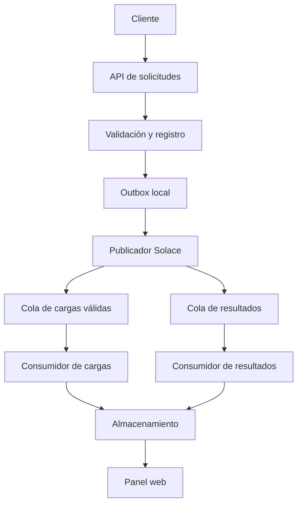

# Arquitectura propuesta

Este documento describe el objetivo. Solo el validador de dominio y la demo están implementados.

## Secuencia y garantías previstas

La API captura el instante de recepción y valida con ese reloj. Almacena la solicitud,
la decisión y los eventos pendientes en una transacción. Un proceso outbox publica
mensajes persistentes y marca el envío después de la confirmación del broker.
Si se cae entre publicar y marcar, puede repetir: los consumidores deben deduplicar.
No se promete entrega exactamente una vez.

Cada consumidor guarda su resultado antes del ACK. La cola transporta mensajes;
el almacenamiento sostiene el historial y las vistas después del ACK.

Al tomar una carga, una actualización condicional de Available a Assigned permite
que solo un conductor gane. Otros intentos reciben un conflicto y refrescan el panel.

La implementación inicial propuesta usa una instancia de aplicación y SQLite.
Los navegadores consultan esa aplicación; no compiten consumiendo directamente las colas.

## Contratos

| Tópico propuesto | Cola suscrita | Contenido |
| --- | --- | --- |
| `axlesignal/v1/dispatch/ready` | `axlesignal.dispatch.ready.v1` | Payload original válido |
| `axlesignal/v1/dispatch/result` | `axlesignal.dispatch.results.v1` | shipperOrderId, status, notes |

Identificadores de evento y correlación irán en propiedades del mensaje para conservar
el cuerpo solicitado. Configurar explícitamente ambas suscripciones en el broker.

La asignación se registra localmente; no se añade un tercer estado al contrato del enunciado.
El envío real de correo no está implementado: la nota Accepted se conserva tal como fue solicitada.
