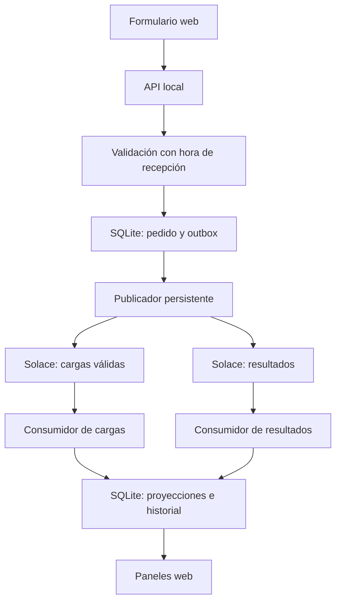

# Arquitectura implementada

Las cajas SQLite son tablas de la misma base local. El publicador espera ACK del broker;
los consumidores guardan antes de su ACK. La pantalla de transportistas solo usa cargas
recibidas desde Solace; el estado Accepted/Cancelled definitivo para clientes viene del
consumidor de resultados. Mientras tanto se indica la decisión local y la espera.

La actualización web consulta cada dos segundos. La asignación es una actualización
condicional en transacción: Available → Assigned una sola vez. Mensajería al menos una
vez con deduplicación; no se promete exactamente una vez ni correo real.
